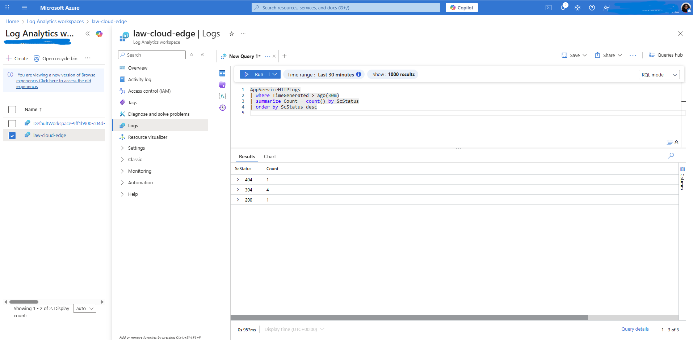
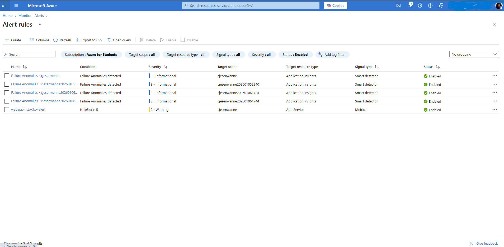

# Secure Azure Containerized Web App with WAF & Monitoring

## Overview
This project demonstrates the deployment of a secure, containerized web application in Microsoft Azure using enterprise-style networking, security, and monitoring practices. The solution focuses on application availability, traffic inspection, centralized logging, and incident detection.

## Architecture
- Hub–spoke virtual network design
- Azure Web App for Containers (Linux)
- Azure Application Gateway (WAF v2) as a secure front door
- Centralized logging with Azure Monitor and Log Analytics

## Key Features
- Secure traffic routing through Application Gateway (WAF v2)
- Container-based application hosting using Microsoft Container Registry
- Centralized diagnostics and log collection
- KQL-based log analysis for HTTP status codes
- Alerting for application failures

## Implementation Highlights
- Designed VNets, subnets, and VNet peering for secure segmentation
- Deployed a Linux-based Web App for Containers using a public container image
- Configured Application Gateway backend pools using FQDN routing
- Enabled diagnostic logging for App Service and Application Gateway
- Queried logs using KQL to validate application health
- Configured Azure Monitor alerts for HTTP 5xx errors

## Monitoring & Troubleshooting
Application and gateway logs were collected in a Log Analytics workspace. KQL queries were used to analyze HTTP status codes and validate application health.

Example query:
```kusto
AppServiceHTTPLogs
| summarize Count = count() by ScStatus
| order by ScStatus desc

```


## Screenshots

### Web App Running
The containerized web application successfully deployed and running on Azure Web App for Containers.


### Application Gateway Backend Health
Backend pool health showing successful routing through Azure Application Gateway (WAF v2).


### Log Analytics KQL Results
KQL query results from Azure Log Analytics analyzing HTTP status codes for application traffic.


### Alert rules
Alert rule configured to detect HTTP server errors and notify support teams.



## Cost Management 
All Azure resources were deleted after validation and documentation to prevent unnecessary charges.


